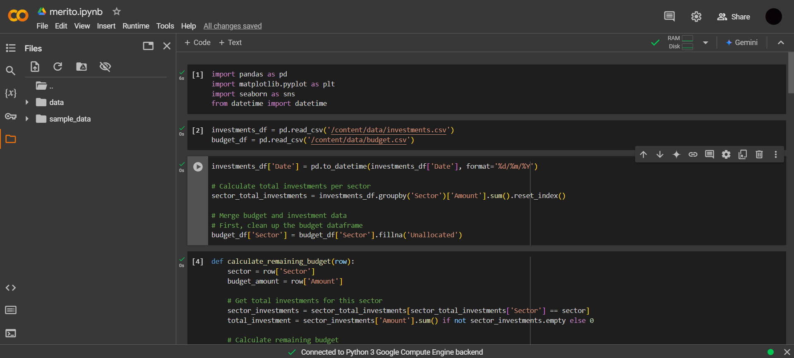

1. Installation
https://github.com/Yash153/nest-crud.git
cd nest-crud

2. Install Dependecies
npm i

3. Start the application
npm run start

4. List of apis
GET: http://localhost:3000/investments/violations - returns list of violated investments
GET: http://localhost:3000/investments/valid - returns list of violated investments
GET: http://localhost:3000/investments - return list of all investments stored in db
GET: http://localhost:3000/budget - return list of all budget rules stored in db

**PART-2**

1. Open merito.ipynb in Google Collab
2. Create a data folder and place the investment.csv and budget.csv there

3. Run All
